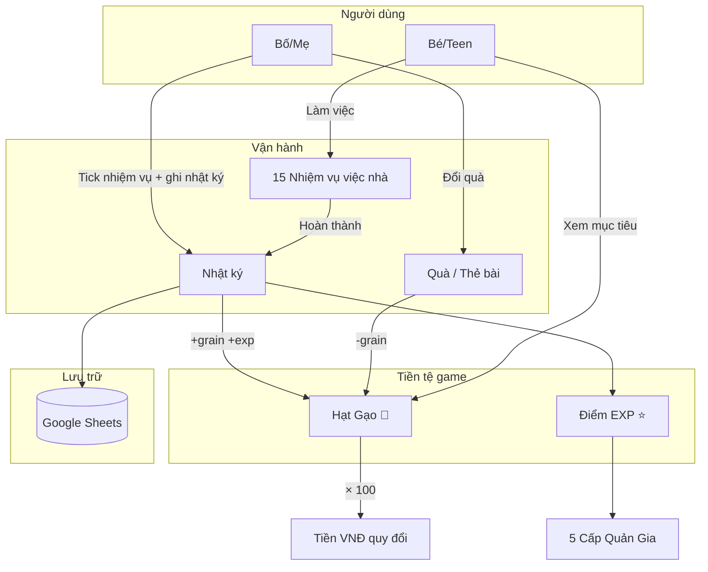
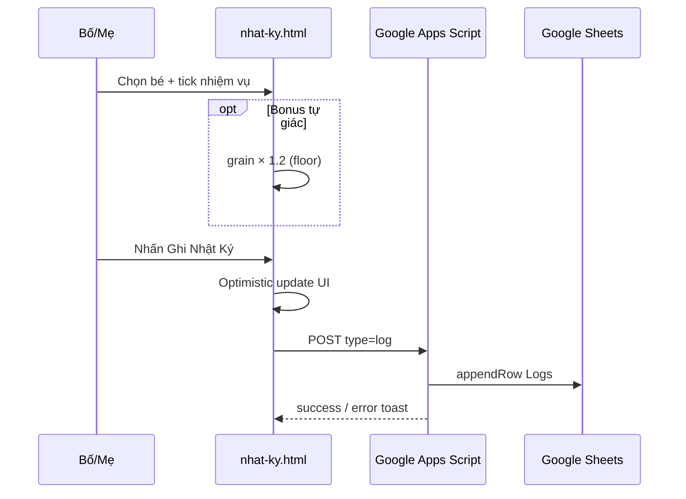
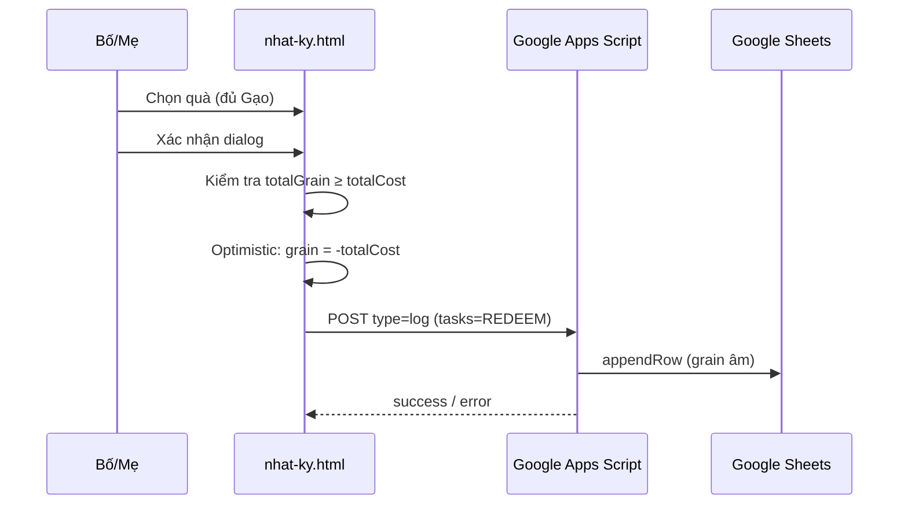

# Tài Liệu Mô Tả Nghiệp Vụ
## Kho Thóc Gia Đình — Hệ thống Gamification Việc Nhà cho Gia Đình

**Phiên bản tài liệu:** 1.0  
**Ngày cập nhật:** 10/06/2026  
**Phạm vi:** Toàn bộ mã nguồn trong repository `keep-house-clean`

---

## Mục lục

1. [Tổng quan sản phẩm](#1-tổng-quan-sản-phẩm)
2. [Mục tiêu và đối tượng sử dụng](#2-mục-tiêu-và-đối-tượng-sử-dụng)
3. [Khái niệm nghiệp vụ cốt lõi](#3-khái-niệm-nghiệp-vụ-cốt-lõi)
4. [Vai trò người dùng](#4-vai-trò-người-dùng)
5. [Quy trình nghiệp vụ chính](#5-quy-trình-nghiệp-vụ-chính)
6. [Danh mục nhiệm vụ việc nhà](#6-danh-mục-nhiệm-vụ-việc-nhà)
7. [Hệ thống phần thưởng](#7-hệ-thống-phần-thưởng)
8. [Cấp bậc Quản Gia](#8-cấp-bậc-quản-gia)
9. [Quy tắc nghiệp vụ và luật chơi](#9-quy-tắc-nghiệp-vụ-và-luật-chơi)
10. [Màn hình và chức năng](#10-màn-hình-và-chức-năng)
11. [Mô hình dữ liệu](#11-mô-hình-dữ-liệu)
12. [Tích hợp và lưu trữ](#12-tích-hợp-và-lưu-trữ)
13. [Khoảng trống thiết kế vs triển khai](#13-khoảng-trống-thiết-kế-vs-triển-khai)
14. [Sơ đồ luồng nghiệp vụ](#14-sơ-đồ-luồng-nghiệp-vụ)

---

## 1. Tổng quan sản phẩm

**Kho Thóc Gia Đình** là hệ thống gamification gia đình giúp trẻ em (đối tượng chính: **10–15 tuổi**) học **giá trị lao động**, **quản lý tài chính cơ bản** và **tinh thần trách nhiệm** thông qua việc nhà.

Con hoàn thành nhiệm vụ → kiếm **Hạt Gạo** (tiền tệ trong game) và **EXP** (điểm kinh nghiệm) → dùng Gạo đổi **thẻ đặc quyền** hoặc **quà tích lũy** → Gạo có thể quy đổi ra **tiền mặt thật** theo tỷ giá cố định do gia đình thống nhất.

### Thành phần hệ thống

| Thành phần | Mô tả |
|---|---|
| Website tĩnh | 5 trang HTML (marketing + vận hành + in ấn) |
| Backend | Google Apps Script đọc/ghi Google Sheets |
| Database | Google Spreadsheet (Profiles + Logs) |

**Đặc điểm:** Không có đăng nhập, không có framework — thiết kế đơn giản cho gia đình tự vận hành.

---

## 2. Mục tiêu và đối tượng sử dụng

### 2.1 Mục tiêu giáo dục

- Khuyến khích trẻ chủ động làm việc nhà mà không cần nhắc nhở liên tục
- Dạy con hiểu mối liên hệ giữa **nỗ lực → phần thưởng → tiết kiệm → mục tiêu dài hạn**
- Xây dựng thói quen ghi chép minh bạch, tổng kết định kỳ
- Biến việc nhà thành trải nghiệm vui, có cấp bậc và mục tiêu rõ ràng

### 2.2 Đối tượng

| Đối tượng | Vai trò trong hệ thống |
|---|---|
| **Bé / Teen (10–15 tuổi)** | Người thực hiện nhiệm vụ, xem catalog quà, lập kế hoạch tích lũy |
| **Bố / Mẹ** | Quản trị viên: xác nhận việc làm, ghi nhật ký, đổi quà, quản lý hồ sơ |
| **Cả gia đình** | Tham khảo quy tắc, in tài liệu treo tường, tổ chức "lễ đổi thưởng" |

### 2.3 Phân cấp nhiệm vụ theo độ tuổi (tham khảo — trên bản in)

| Cấp | Độ tuổi | Ví dụ nhiệm vụ |
|---|---|---|
| Tập sự | Dưới 10 | Dọn đồ chơi, gấp chăn, đổ rác |
| Trợ thủ | 10–12 | Rửa bát, quét nhà, tưới cây |
| Quản gia | 13–15 | Nấu ăn, đi chợ, tổng vệ sinh |

*Lưu ý: Phân cấp theo tuổi chỉ xuất hiện trên `print.html`; app vận hành dùng chung 15 nhiệm vụ cho mọi bé.*

---

## 3. Khái niệm nghiệp vụ cốt lõi

### 3.1 Hai loại tiền tệ trong game

| Khái niệm | Tên hiển thị | Vai trò | Cách kiếm | Cách dùng |
|---|---|---|---|---|
| **Hạt Gạo** | 🌾 Gạo | Tiền tệ — đổi quà, quy ra tiền thật | Cộng khi hoàn thành nhiệm vụ (được ba mẹ xác nhận) | Trừ khi đổi quà/thẻ bài |
| **EXP** | ⭐ Điểm Sành Sỏi | Cấp độ kỹ năng — thăng hạng Quản Gia | Cộng khi hoàn thành nhiệm vụ | **Không** bị trừ khi đổi quà |

### 3.2 Tỷ giá quy đổi (cố định)

```
1 Hạt Gạo = 100 VNĐ
10 Hạt Gạo = 1.000 VNĐ
5.000 Hạt Gạo = 500.000 VNĐ (ví dụ: đôi giày)
```

Tỷ giá được hiển thị trên trang chủ, trang quy đổi và dashboard nhật ký. **Không có giao dịch tiền thật trong app** — quy đổi là cam kết gia đình, thực hiện ngoài hệ thống.

### 3.3 Ba tầng phần thưởng (triết lý sản phẩm)

1. **Đặc quyền tức thì** — Thẻ bài dùng ngay (ăn vặt, trì hoãn giờ ngủ, miễn việc...)
2. **Trải nghiệm / kỷ niệm** — Quà dài hạn (sách, bữa ăn, mời bạn, tự do đi chơi...)
3. **Quy đổi tiền thật** — Tích lũy Gạo → rút ra VNĐ theo tỷ giá

---

## 4. Vai trò người dùng

Hệ thống **không có xác thực đăng nhập**. Phân quyền dựa trên trang người dùng truy cập:

| Vai trò | Trang sử dụng | Quyền hạn |
|---|---|---|
| **Quản trị viên (Bố/Mẹ)** | `nhat-ky.html` | Tạo hồ sơ bé; chọn bé; tick nhiệm vụ; bật bonus tự giác; ghi nhật ký; đổi quà; xóa nhật ký; xem lịch sử |
| **Người chơi (Bé)** | `kho-qua.html`, `quy-doi.html`, `print.html` | Xem catalog quà, tính mục tiêu tích lũy, in thẻ bài |
| **Khách / Gia đình** | `index.html` | Đọc quy tắc, nhiệm vụ mẫu, luật phạt (hướng dẫn) |

**Rủi ro vận hành:** Bất kỳ ai mở được `nhat-ky.html` đều có quyền admin đầy đủ.

---

## 5. Quy trình nghiệp vụ chính

### 5.1 Vòng đời tổng quát

```
Đăng ký bé → Nhận nhiệm vụ → Làm việc → Ba mẹ xác nhận & ghi nhật ký
    → Cộng Gạo + EXP → Thăng cấp Quản Gia → Đổi thẻ/quà hoặc tích lũy quy tiền
```

### 5.2 Quy trình: Đăng ký hồ sơ bé

| Bước | Hành động | Kết quả |
|---|---|---|
| 1 | Bố/mẹ mở `nhat-ky.html`, nhấn "Đăng ký bé mới" | Hiện form nhập tên |
| 2 | Nhập tên bé, xác nhận | Tạo Profile mới (`id = p_<timestamp>`), lưu Google Sheets |
| 3 | Hệ thống hiển thị thẻ bé trên dashboard | Số dư Gạo = 0, EXP = 0, cấp Tân Binh |

**Giới hạn hiện tại:** Không có UI sửa tên/avatar hoặc xóa hồ sơ (backend hỗ trợ update nếu gửi cùng `id`).

### 5.3 Quy trình: Ghi nhật ký hàng ngày

| Bước | Hành động | Điều kiện |
|---|---|---|
| 1 | Chọn bé trên dashboard | Bắt buộc |
| 2 | Tick ≥ 1 nhiệm vụ đã hoàn thành | Bắt buộc — báo lỗi nếu không tick |
| 3 | (Tùy chọn) Bật "Tự giác — không cần nhắc nhở" | +20% Gạo |
| 4 | (Tùy chọn) Nhập ghi chú | Tự do |
| 5 | Nhấn "Ghi Nhật Ký" | Tạo bản ghi Log, đồng bộ Sheets |

**Công thức tính thưởng:**

```
grain_base = Σ (grain của từng nhiệm vụ đã tick)
grain_final = floor(grain_base × 1.2)   nếu bật bonus tự giác
            = grain_base                 nếu không bật
exp = Σ (exp của từng nhiệm vụ đã tick)
```

**Cập nhật UI:** Optimistic — cộng vào cache ngay, đồng bộ Google Sheets nền.

### 5.4 Quy trình: Đổi quà / thẻ bài

| Bước | Hành động | Điều kiện |
|---|---|---|
| 1 | Chọn bé | Bắt buộc |
| 2 | Chọn 1 hoặc nhiều quà trong lưới | Chỉ quà đủ Gạo mới chọn được |
| 3 | Nhấn "Nhận Quà Đã Chọn" | Hiện dialog xác nhận |
| 4 | Xác nhận | Tạo Log: `grain = -totalCost`, `exp = 0`, `tasks = 'REDEEM'` |

**Validation:**
- Tổng Gạo hiện có ≥ tổng chi phí quà
- Phải chọn ≥ 1 quà
- Quà không đủ Gạo: thẻ bị `disabled`, toast cảnh báo khi click

### 5.5 Quy trình: Xóa nhật ký (hoàn tác)

| Bước | Hành động | Ghi chú |
|---|---|---|
| 1 | Trong lịch sử, nhấn nút xóa trên dòng cần hoàn tác | — |
| 2 | Xác nhận | Gọi API `delete_log` theo cặp `(profileId, date)` |
| 3 | Server xóa dòng trên Sheets | Số dư Gạo/EXP tính lại từ tổng logs |

**Khác biệt với ghi nhật ký:** Không optimistic — cần chờ server xác nhận.

### 5.6 Quy trình: Lập kế hoạch tích lũy (trang Quy Đổi)

Người dùng nhập số Gạo hoặc số tiền VNĐ → hệ thống tính ngược:
- `VNĐ = Gạo × 100`
- `Gạo cần = ceil(VNĐ_mục_tiêu / 100)`

Hiển thị thanh tiến độ (max 8.000 Gạo), danh sách mục tiêu unlock, biểu đồ chi phí quà.

---

## 6. Danh mục nhiệm vụ việc nhà

Hệ thống có **15 nhiệm vụ cố định**, chia 3 nhóm hiển thị:

### 6.1 Nhiệm vụ Sử Thi — Lớn (`type: epic`)

| ID | Tên game hóa | Việc thực tế | Gạo | EXP |
|---|---|---|---|---|
| t1 | Đại chiến Kho Thóc | Tổng vệ sinh nhà cửa | 150 | 100 |
| t2 | Trợ lý Đầu bếp | Nấu 1 bữa hoàn chỉnh | 100 | 80 |

### 6.2 Nhiệm vụ Hằng ngày — Ưu tiên (`type: highlight`)

| ID | Tên game hóa | Việc thực tế | Gạo | EXP |
|---|---|---|---|---|
| t3 | Phá băng bồn rửa | Rửa bát · ~15 phút | 15 | 10 |
| t4 | Tấn công bụi bẩn | Quét & lau nhà · ~20 phút | 25 | 20 |
| t5 | Thiết lập bàn | Dọn bàn học · ~10 phút | 10 | 5 |

### 6.3 Nhiệm vụ thường (`type: normal`)

| ID | Tên game hóa | Việc thực tế | Gạo | EXP |
|---|---|---|---|---|
| t6 | Triệu hồi đồ giặt | Gấp & cất đồ · ~15 phút | 20 | 15 |
| t7 | Dọn sạch phế liệu | Đổ rác · ~10 phút | 10 | 5 |
| t8 | Chăm sóc Long bào | Giặt/Phơi đồ · ~20 phút | 25 | 20 |
| t9 | Thanh tẩy bảo vật | Giặt giày · ~35 phút | 35 | 30 |
| t10 | Tu luyện kiến thức | Tự học · 1 tiếng | 30 | 25 |
| t11 | Hộ vệ thảo dược | Tưới cây · ~20 phút | 20 | 15 |
| t12 | Viễn chinh lương thực | Đi chợ · ~30 phút | 30 | 25 |
| t13 | Thu dọn Giang sơn | Dọn phòng · ~10 phút | 10 | 5 |
| t14 | Bảo dưỡng pháp bảo | Lau bàn ăn · ~10 phút | 10 | 5 |
| t15 | Giải cứu thủy cung | Dọn WC · ~10 phút | 20 | 10 |

### 6.4 Ước lượng kiếm Gạo (tham khảo vận hành)

| Mức độ | Gạo/ngày |
|---|---|
| Ngày tích cực | ~80–120 |
| Ngày bình thường | ~40–70 |
| 1 tuần | ~300–600 |

---

## 7. Hệ thống phần thưởng

### 7.1 Thẻ bài đặc quyền (dùng ngay, 1 lần)

| ID | Tên | Giá (Gạo) | Mô tả nghiệp vụ |
|---|---|---|---|
| r13 | Bảo Khí Giòn Rụm | 200 | Ăn vặt tùy chọn |
| r14 | Hàn Băng Ngọc Thạch | 250 | Kem / đồ lạnh |
| r15 | Mật Đạo Tiêu Dao | 300 | Chơi ngoài trời thêm |
| r7 | Đèn Dầu Thắp Muộn | 350 | Trì hoãn giờ đi ngủ |
| r12 | Lệnh Trưng Thu Đất | 600 | Miễn 1 nhiệm vụ trong ngày |
| r11 | Phiên Chợ Tự Do | 850 | Chọn món ăn tối |
| r8 | Bù Nhìn Thế Thân | 900 | Nhờ làm hộ 1 việc |
| r10 | Khuôn Bánh Chưng | 1.600 | Nghỉ việc nhà 1 ngày |
| r9 | Hạt Nếp Thần Lực | 2.000 | Đi chơi không cần xin phép trước |

**Quy ước:** Thẻ dùng 1 lần, in ra giấy — **không enforce tự động** trong app.

### 7.2 Quà dài hạn (tích lũy)

#### Trong app vận hành (`nhat-ky.html`) — giá cố định 1 mức/quà

| ID | Tên | Giá tối thiểu (Gạo) |
|---|---|---|
| r1 | Gói "Mở Mang Bờ Cõi" (sách) | 800 |
| r6 | Vé "Đêm Phim Gia Đình" | 1.200 |
| r2 | Mâm Cỗ "Mừng Vụ Mùa" | 1.200 |
| r4 | Giấy "Thông Hành Viễn Chinh" | 1.600 |
| r3 | Lệnh Bài "Mở Cổng Thành" (mời bạn) | 2.400 |
| r5 | Gói "Kinh Lý Đô Thành" (du lịch/ăn uống lớn) | 4.000 |

#### Trong catalog (`kho-qua.html`) — nhiều bậc giá chi tiết

| Quà | Khoảng giá | Ví dụ bậc |
|---|---|---|
| Sách | 800 – 2.400 | Truyện tranh 800 → Bộ sách 2.400 |
| Mâm cỗ | 1.200 – 1.600 | 1 món yêu thích → Bữa cả nhà |
| Mời bạn | 2.400 – 4.000 | 2 bạn chiều → Tiệc ngủ cuối tuần |
| Tự do đi chơi | 1.600 – 3.200 | 1 buổi → Miễn kiểm tra điện thoại 1 tuần |
| Du lịch / ăn uống lớn | 4.000 – 16.000 | Ăn buffet → Du lịch 2 ngày |

**Lưu ý nghiệp vụ:** Catalog marketing mô tả đầy đủ các tier; app vận hành chỉ trừ **một mức giá tối thiểu** — ba mẹ tự quyết định tier thực tế khi trao quà.

---

## 8. Cấp bậc Quản Gia

Cấp bậc xác định bởi **tổng EXP tích lũy** (không giảm khi đổi quà):

| Cấp | Emoji | Ngưỡng EXP | Đặc quyền (theo thiết kế) |
|---|---|---|---|
| Tân Binh | 🌱 | 0 – 199 | Cơ bản |
| Thợ Cày | 🌿 | 200 – 499 | +5% bonus Gạo |
| Điền Chủ | 🌾 | 500 – 999 | +10% bonus Gạo |
| Lão Làng | 🏡 | 1.000 – 1.999 | +15% bonus Gạo + đặc quyền |
| Đại Điền Chủ | 👑 | 2.000+ | +20% bonus Gạo + tất cả quyền |

**Công thức tiến độ cấp hiện tại:**

```
rank = cấp có min ≤ totalExp cao nhất
tiến độ % = (totalExp - rank.min) / (rank.max - rank.min) × 100
```

Không có sự kiện "lên cấp" riêng — chỉ hiển thị khi render profile.

---

## 9. Quy tắc nghiệp vụ và luật chơi

### 9.1 Quy tắc đã triển khai trong app (`nhat-ky.html`)

| # | Quy tắc | Chi tiết |
|---|---|---|
| R1 | Ít nhất 1 nhiệm vụ khi ghi nhật ký | Alert nếu không tick |
| R2 | Phải chọn bé trước mọi thao tác | Toast cảnh báo |
| R3 | Bonus tự giác | +20% Gạo, làm tròn xuống (`Math.floor`) |
| R4 | Đổi quà | Kiểm tra đủ Gạo; confirm; ghi grain âm |
| R5 | Quà không đủ Gạo | Card disabled |
| R6 | Số dư | Luôn tính từ tổng logs, **không** tin cột `balance` trên sheet |

### 9.2 Luật Thiên Tai — Cơ chế phạt (trên trang chủ, **chưa tự động hóa**)

| Vi phạm | Hình phạt |
|---|---|
| Quên làm việc đã nhận | −20 Gạo |
| Làm dối / làm ẩu | Làm lại; nhiệm vụ sau chỉ 50% Gạo |
| Đổi thưởng xong không giữ lời | Mất thẻ, −50 Gạo |
| 3 ngày liên tiếp không làm gì | Đóng băng Kho 24 giờ |

### 9.3 Bonus theo cấp bậc (marketing, **chưa tự động hóa**)

+5% / +10% / +15% / +20% Gạo theo cấp — mô tả trên UI, **chưa áp dụng** khi ghi nhật ký.

### 9.4 Nguyên tắc vận hành cho ba mẹ (trang Quy Đổi)

1. Giữ **tỷ giá cố định** — không thay đổi tùy hứng
2. Ghi chép **minh bạch** — con được xem số dư
3. **Tổng kết hàng tuần** — review tiến độ cùng nhau
4. **"Lễ đổi thưởng"** có nghi thức — tôn vinh nỗ lực
5. **Điều chỉnh Gạo** theo từng con — công bằng nhưng linh hoạt
6. **Khen hành vi chủ động** — bonus tự giác là công cụ chính

---

## 10. Màn hình và chức năng

| Trang | File | Đối tượng | Chức năng nghiệp vụ |
|---|---|---|---|
| Trang Chủ | `index.html` | Cả gia đình | Giới thiệu; 2 loại tiền tệ; tỷ giá; quy trình 4 bước; 15 nhiệm vụ; 5 cấp bậc; luật phạt |
| Kho Quà | `kho-qua.html` | Bé (xem), ba mẹ (tham khảo) | Catalog 6 quà dài hạn (nhiều tier); 9 thẻ bài; lọc tag; in thẻ |
| Quy Đổi | `quy-doi.html` | Con + ba mẹ | Máy tính Gạo↔VNĐ; mục tiêu unlock; biểu đồ chi phí; kế hoạch ngày/tuần; bí kíp vận hành |
| Nhật Ký | `nhat-ky.html` | **Bố mẹ** | Dashboard bé; ghi nhiệm vụ; bonus; đổi quà; lịch sử; CRUD profile |
| In | `print.html` | Gia đình | Infographic quy trình; cấp bậc; bảng quy đổi; nhiệm vụ theo tuổi; quà; thẻ cắt in A4 ngang |

**Menu điều hướng chuẩn:** Trang Chủ | Kho Quà | Quy Đổi | Nhật Ký | In | Tính Gạo (CTA)  
*Ngoại lệ: `print.html` có nav riêng.*

---

## 11. Mô hình dữ liệu

### 11.1 Profile (Hồ sơ bé)

| Trường | Kiểu | Ý nghĩa |
|---|---|---|
| `id` | Text | Mã duy nhất, dạng `p_<timestamp>` |
| `name` | Text | Tên bé |
| `avatar` | Text | Emoji (mặc định 👶) |
| `balance` | Number | **Legacy — không dùng** |
| `history` | JSON string | **Legacy — mặc định `[]`** |

### 11.2 Log (Nhật ký giao dịch)

| Trường | Kiểu | Ý nghĩa |
|---|---|---|
| `id` | Text | ID bé (profileId) |
| `name` | Text | Tên bé lúc ghi |
| `date` | Text | `YYYY-MM-DD HH:mm` — khóa xóa |
| `grain` | Number | Gạo (+ làm việc, **− đổi quà**) |
| `exp` | Number | EXP (chỉ > 0 khi làm việc) |
| `tasks` | Text | Danh sách `taskId` phân cách dấu phẩy, hoặc `REDEEM` |
| `bonus` | Boolean | Có bật thưởng tự giác 20% |
| `note` | Text | Ghi chú / mô tả quà đổi |

### 11.3 Công thức số dư

```
totalGrain = SUM(log.grain)     // grain âm = đổi quà
totalExp   = SUM(log.exp)       // không trừ khi đổi quà
tiền_quy_đổi = totalGrain × 100 VNĐ
```

### 11.4 Redemptions (Roadmap — chưa triển khai)

Sheet riêng dự kiến: `id | name | date | grain_spent | reward_id | reward_name | note`

---

## 12. Tích hợp và lưu trữ

### 12.1 Google Sheets

| Sheet | Cột | Ghi chú |
|---|---|---|
| Profiles | id, name, avatar, balance, history | balance không dùng |
| Logs | id, name, date, grain, exp, tasks, bonus, note | Giao dịch dương và âm |
| Redemptions | *(chưa tạo)* | Dự kiến tách giao dịch đổi quà |

**Spreadsheet ID:** `1JhOR_Ry5Z9h__wH288zVS2KtYPUD-8PgCWS1KZoErmU`

### 12.2 API Google Apps Script

| Method | Endpoint | Mô tả |
|---|---|---|
| GET | `doGet` | Trả `{ profiles, logs }` |
| POST | `doPost` | Ghi dữ liệu theo `type` |

**POST types:**

| type | Hành động |
|---|---|
| *(default)* | Tạo/cập nhật Profile |
| `log` | Thêm dòng Logs |
| `delete_log` | Xóa log theo `profileId` + `date` |
| `redeem` | *(roadmap)* Ghi Redemptions |

**Lưu ý kỹ thuật vận hành:** POST phải dùng `Content-Type: text/plain` (workaround CORS). Mỗi lần sửa Code.gs cần tạo **New Deployment**.

### 12.3 Dịch vụ bên ngoài khác

- Google Fonts (Baloo 2, Mulish)
- Font Awesome 6.4
- Chart.js (chỉ trang Quy Đổi)

---

## 13. Khoảng trống thiết kế vs triển khai

| # | Hạng mục | Thiết kế (marketing/tài liệu) | Triển khai thực tế |
|---|---|---|---|
| G1 | Luật phạt & bonus cấp bậc | Có trên `index.html` | **Chưa** trong app vận hành |
| G2 | Quà nhiều tier | Catalog HTML đầy đủ | App chỉ dùng giá tối thiểu |
| G3 | Sheet Redemptions | Roadmap | Dùng log grain âm + `tasks='REDEEM'` |
| G4 | Xác thực người dùng | — | Không có — ai cũng là admin |
| G5 | Sửa/xóa hồ sơ bé | — | Chưa có UI |
| G6 | Nav `print.html` | Đồng bộ với các trang | Nav riêng, chưa đồng bộ |
| G7 | URL API | Nhiều phiên bản deployment | Cần thống nhất khi vận hành |

---

## 14. Sơ đồ luồng nghiệp vụ

### 14.1 Luồng tổng quan



### 14.2 Luồng ghi nhật ký



### 14.3 Luồng đổi quà



---

## Phụ lục: Hằng số nghiệp vụ

| Hằng số | Giá trị | Nguồn |
|---|---|---|
| Tỷ giá Gạo | 1 Gạo = 100 VNĐ | `quy-doi.html`, `nhat-ky.html` |
| Bonus tự giác | × 1.2 (+20%) | `nhat-ky.html` |
| Số nhiệm vụ | 15 | `nhat-ky.html` |
| Số phần thưởng | 15 (9 thẻ + 6 quà) | `nhat-ky.html` |
| Số cấp bậc | 5 | `nhat-ky.html` |
| Thanh tiến độ max | 8.000 Gạo (≈ 800.000 VNĐ) | `quy-doi.html` |

---

*Tài liệu được tổng hợp từ: `code/index.html`, `code/kho-qua.html`, `code/quy-doi.html`, `code/nhat-ky.html`, `code/print.html`, `docs/datasource/appscripv11.md`, `docs/datasource/session_snapshot.md`, `docs/README.md`.*
