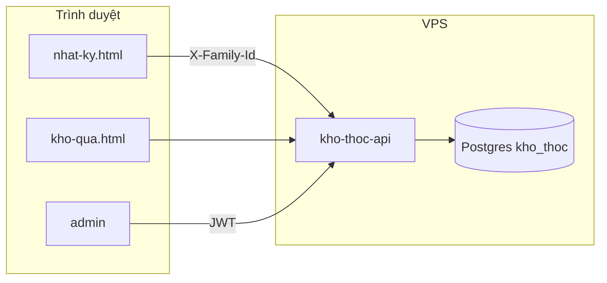

# Use Case & Actor — Kho Thóc Gia Đình

## Actors

| Actor | Mô tả | Trang chính |
|-------|-------|-------------|
| **Bố/mẹ** | Ghi nhật ký, đăng ký/xóa bé, đổi quà | `code/nhat-ky.html` |
| **Bé** | Xem quà, lập kế hoạch quy đổi | `code/kho-qua.html`, `code/quy-doi.html` |
| **Admin** | Sinh/thu hồi passcode đổi quà | `code/admin/login.html` |
| **Hệ thống** | API + Postgres, cách ly theo `family_id` | `code/kho-thoc-api/` |

## Luồng tổng quan

## Domain tương tác

| Domain | Actor | API chính | Doc |
|--------|-------|-----------|-----|
| Nhật ký | Bố/mẹ | `log`, `profile`, `delete_profile` | [nhatky.md](./nhatky.md) |
| Đổi quà | Bố/mẹ + Bé | `redeem` + passcode | [passcode.md](./passcode.md) |
| Admin | Admin | `/admin/*` JWT | [admin.md](./admin.md) |

## Use case nhanh — Bố/mẹ

1. Mở Nhật Ký → hệ thống gán/nhận `family_id` (localStorage)
2. Đăng ký bé (tối đa 3/gia đình)
3. Ghi nhiệm vụ → cộng Gạo + EXP
4. Đổi quà → nhập passcode của bé

## Use case nhanh — Cách ly gia đình

- Mỗi trình duyệt một `family_id` → chỉ thấy bé của gia đình đó
- Gia đình mới chưa có bé → danh sách trống (không lẫn dữ liệu người khác)
- Chi tiết: [nhatky.md](./nhatky.md)
