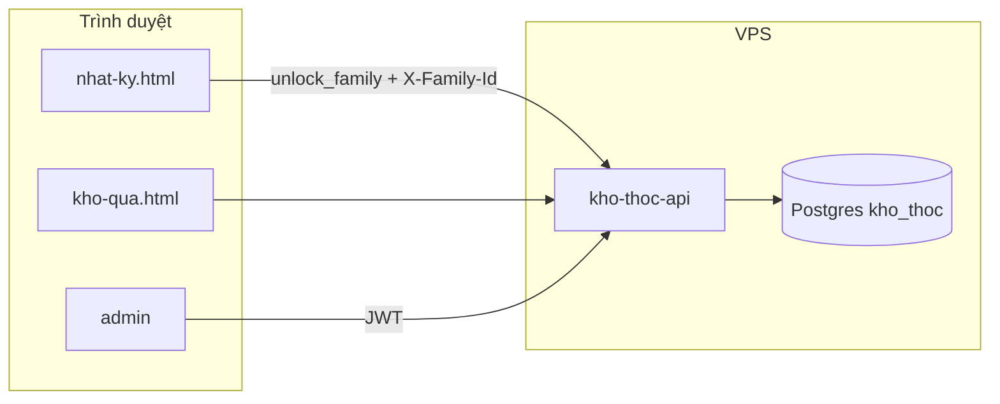

# Use Case & Actor — Kho Thóc Gia Đình

**Cập nhật:** 14/06/2026

## Actors

| Actor | Mô tả | Trang chính |
|-------|-------|-------------|
| **Bố/mẹ** | Mở phiên passcode, ghi nhật ký, đăng ký/xóa bé, đổi quà | `code/nhat-ky.html` |
| **Bé** | Xem quà, lập kế hoạch quy đổi | `code/kho-qua.html`, `code/quy-doi.html` |
| **Admin** | Sinh/thu hồi passcode đổi quà | `code/admin/login.html` |
| **Hệ thống** | API + Postgres, cách ly theo `family_id` | `code/kho-thoc-api/` |

## Luồng tổng quan

## Domain tương tác

| Domain | Actor | API chính | Doc |
|--------|-------|-----------|-----|
| Phiên gia đình | Bố/mẹ | `unlock_family` | [family-session.md](./family-session.md) |
| Nhật ký | Bố/mẹ | `log`, `profile`, `delete_profile` | [nhatky.md](./nhatky.md) |
| Đổi quà | Bố/mẹ + Bé | `redeem` + passcode tầng 2 | [passcode.md](./passcode.md) |
| Admin | Admin | `/admin/*` JWT | [admin.md](./admin.md) |

## Use case — Bố/mẹ (Nhật Ký)

### UC-NK-01 — Mở phiên trên trình duyệt mới

1. Mở Nhật Ký → danh sách bé trống (chưa có phiên)
2. Chạm thao tác bất kỳ → modal nhập passcode (mã một bé trong nhà)
3. Server trả `familyId` → lưu localStorage → hiển thị đúng bé

### UC-NK-02 — Gia đình mới (bootstrap)

1. Mở Nhật Ký → chọn "Đăng ký bé đầu tiên" (không cần passcode)
2. Nhập tên bé → server tạo `family_id` + passcode
3. Modal hiện mã → phiên được mở tự động

### UC-NK-03 — Ghi nhiệm vụ

1. Đã mở phiên → chọn bé → tick nhiệm vụ → Ghi Nhật Ký
2. **Không** nhập passcode lần 2

### UC-NK-04 — Đổi quà

1. Đã mở phiên → chọn bé → chọn quà → Nhận Quà
2. Modal passcode **lần nữa** (tầng 2) → xác nhận đổi

### UC-NK-05 — Mất phiên

1. Xóa cache hoặc đổi trình duyệt
2. Quay lại UC-NK-01

## Use case — Cách ly gia đình

- `family_id` chỉ có sau unlock hoặc bootstrap — không sinh UUID vô nghĩa
- Mỗi gia đình chỉ thấy bé của mình
- Chi tiết: [nhatky.md](./nhatky.md) · [family-session.md](./family-session.md)
