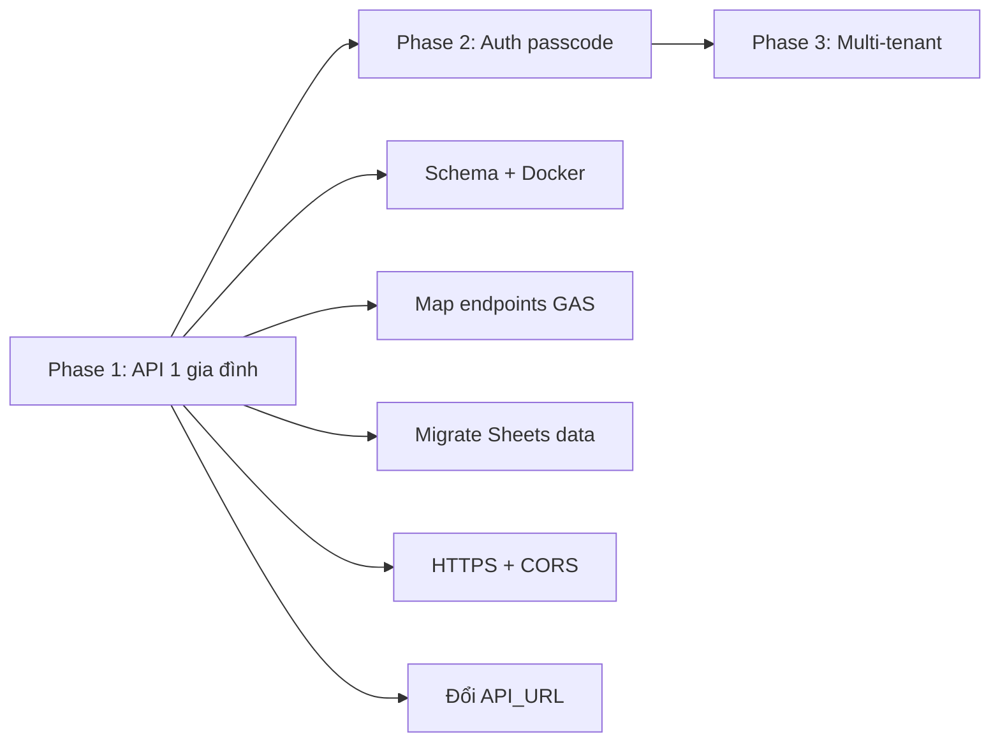

# Kế hoạch migrate: VPS + Docker + API + PostgreSQL thay Google Apps Script

**Cập nhật:** 10/06/2026  
**Trạng thái:** Phase 1 — code xong, **đã test local**; chờ deploy VPS + cutover production  
**Liên quan:** [tech/architecture/infrastructure.md](./architecture/infrastructure.md) · [installation.md](../installation.md) · [operations.md](../operations.md) · [tech/legacy/apps-script-v11.md](./legacy/apps-script-v11.md)

---

## 1. Kiến trúc hiện tại

```
GitHub Pages (frontend)  →  Google Apps Script  →  Google Sheets
```

| Thành phần | Vai trò |
|---|---|
| Frontend | HTML/JS tĩnh trên GitHub Pages |
| Backend | Apps Script (`doGet` / `doPost`) — profiles, logs, pagination |
| DB | Spreadsheet `Profiles` + `Logs` |
| Client | `assets/js/pages/nhat-ky.js` gọi `API_URL`, POST với `Content-Type: text/plain` (workaround CORS) |

API hiện tại đơn giản: ~5 endpoint logic, vài trăm dòng GAS. Frontend đã có cache `localStorage`, pagination logs, optimistic update số dư.

---

## 2. Kiến trúc đề xuất

```
GitHub Pages  →  HTTPS API (VPS)  →  PostgreSQL (Docker)
                     ↑
              kho-thoc-api container
              dùng chung eedt-postgres
```

Chi tiết triển khai: xem [tech/architecture/infrastructure.md](./architecture/infrastructure.md). Tóm tắt:

- Giữ frontend trên GitHub Pages
- Thêm container Node.js (`kho-thoc-api`, port nội bộ 3001)
- Database `kho_thoc` trong Postgres sẵn có (`eedt-postgres`)
- Nginx reverse proxy HTTPS → API

---

## 3. So sánh Apps Script vs VPS + PostgreSQL

### 3.1 Điểm mạnh khi migrate

| Hạng mục | Apps Script (hiện tại) | VPS + PostgreSQL |
|---|---|---|
| **Cold start** | 2–10s lần đầu; cần trigger ping 5 phút | Phản hồi ổn định ~50–200ms |
| **CORS** | Hack `text/plain`, không dùng `application/json` | CORS chuẩn, REST đúng nghĩa |
| **Deploy** | Mỗi sửa Code.gs → New Deployment, đổi URL | `docker compose up -d` hoặc CI |
| **Multi-tenant** | Không có — 1 sheet, ai biết URL là admin | `family_id`, passcode, phân quyền admin/kid |
| **Query phức tạp** | Quét toàn sheet, chậm khi log nhiều | Index SQL, pagination thật, aggregation |
| **Bảo mật** | Không auth — ai cũng ghi được (G4 trong tài liệu nghiệp vụ) | JWT/passcode, hash bcrypt |
| **Redemptions** | Workaround `tasks='REDEEM'` | Bảng `redemptions` riêng (roadmap) |
| **Backup** | Phụ thuộc Google | `pg_dump` cron, kiểm soát được |
| **Giới hạn quota** | 6 phút/exec, quota GAS/Sheets | Chỉ giới hạn bởi VPS |

### 3.2 Điểm yếu / chi phí khi migrate

| Hạng mục | Apps Script | VPS + PostgreSQL |
|---|---|---|
| **Chi phí vận hành** | $0 (trong quota Google) | VPS đã có (~$6–12/tháng Vultr) — **không tăng nhiều** nếu dùng chung instance |
| **Ops** | Không cần server | SSL, backup, monitor RAM, update OS/image |
| **RAM** | Không lo | VPS 1 GB đã chạy WordPress + eedt + Postgres — **điểm nghẽn chính** |
| **Thời gian build** | Đã chạy production | Schema + API + auth + migrate data + test |
| **Xem/sửa data thủ công** | Mở Sheets trực tiếp | Cần pgAdmin, DBeaver, hoặc admin UI |
| **Độ tin cậy** | Google SLA | Phụ thuộc vận hành VPS — 1 VPS down = API down |

---

## 4. Khả thi kỹ thuật với VPS hiện tại

Theo [tech/architecture/infrastructure.md](./architecture/infrastructure.md), VPS Singapore **1 vCPU / 1 GB RAM** đang chạy 6 container + bot Telegram.

**Kết luận: khả thi, nhưng có điều kiện.**

| Khuyến nghị | Lý do |
|---|---|
| Dùng chung `eedt-postgres`, tạo DB `kho_thoc` | Tránh thêm container Postgres (~100–200 MB RAM) |
| Container API Node nhẹ (~50–80 MB) | Express/Fastify + `pg`, không cần Redis riêng lúc đầu |
| Không expose 5432 ra internet | Chỉ Docker network |
| HTTPS qua Nginx/Caddy (Let's Encrypt) | Bắt buộc — GitHub Pages chặn mixed content |
| Kiểm tra `free -h` / `docker stats` trước deploy | Tránh OOM kill toàn stack |

**Ngưỡng cảnh báo:** nếu eedt + WordPress đã dùng >700 MB RAM thường xuyên, nên nâng VPS lên **2 GB** (~$2–4/tháng thêm) trước khi thêm API production.

---

## 5. Độ phức tạp migration

### 5.1 Backend (ước lượng 2–4 ngày dev)

API mới cần map 1:1 logic hiện tại:

```
GET  ?type=profiles | logs | ping | all
POST type=log | delete_log | profile
```

Thêm (multi-tenant + phiên gia đình):

- `POST type=unlock_family` — passcode bé → `familyId` (Phase 3.1)
- Header `X-Family-Id` trên mọi request sau unlock
- `POST type=redeem` — passcode mỗi lần đổi quà
- Migration: `004_family_id.sql`

### 5.2 Frontend (ước lượng 0.5–1 ngày)

Thay đổi tối thiểu:

1. `assets/js/data/config.js` — đổi `API_URL`
2. `family-api.js` — phiên passcode (`unlock_family`, không auto UUID)
3. `nhat-ky.js` — modal tầng 1 (phiên) + tầng 2 (đổi quà)
4. Giữ cache `localStorage` profiles/logs theo `family_id`

Contract JSON có thể giữ tương thích để giảm rủi ro:

```json
{ "profiles": [...], "logs": [...], "total": N, "hasMore": true }
```

### 5.3 Data migration

- **1 gia đình hiện tại:** export 2 sheet → import — đơn giản, 1–2 giờ.
- **100 gia đình (mục tiêu multi-tenant):** cần onboarding flow tạo `family`, không chỉ migrate.

---

## 6. Khi nào nên migrate?

### Nên migrate nếu

- Muốn **multi-tenant** (~100 gia đình) với passcode admin/kid
- Cần **bảo mật** — không để ai biết URL đều sửa được dữ liệu con
- Muốn **tách Redemptions**, query báo cáo, hoặc mở rộng API
- Cold start GAS + workaround CORS đang gây khó chịu thực tế
- Đã có VPS, chi phí thêm gần như **$0** (chỉ thời gian dev)

### Có thể giữ GAS thêm nếu

- Chỉ **1 gia đình**, không có kế hoạch mở rộng
- Ưu tiên **zero ops** — không muốn lo SSL/backup/monitor
- Thích **xem/sửa data trực tiếp trên Sheets** (bố mẹ quen spreadsheet)
- VPS RAM đang căng, chưa sẵn sàng nâng cấp

---

## 7. Rủi ro chính và cách giảm

| Rủi ro | Giảm thiểu |
|---|---|
| OOM trên VPS 1 GB | Dùng chung Postgres; monitor; nâng RAM nếu cần |
| Mất dữ liệu khi chuyển | `pg_dump` hàng ngày; giữ Sheets làm backup read-only 1 tháng |
| Frontend break khi đổi API | Giữ contract JSON; deploy API trước, feature flag URL |
| Không có auth ngay | Phase 1: API key cố định trong header; Phase 2: passcode/JWT |
| HTTPS chưa setup | Caddy auto-SSL hoặc certbot trên Nginx — làm **trước** khi đổi frontend |

---

## 8. Lộ trình đề xuất



### Phase 1 — MVP (~1 tuần)

API thay GAS cho **1 gia đình**, chưa auth — chứng minh ổn định trên VPS.

#### Đã làm (code + local)

- [x] Schema SQL + migration — `kho-thoc-api/migrations/001_init.sql`
- [x] API Node.js map contract GAS (`doGet` / `doPost`) — `kho-thoc-api/src/`
- [x] Dockerfile + `docker-compose.yml` — **chỉ container API**, dùng `eedt-postgres` sẵn có
- [x] User + DB PostgreSQL **tách biệt** — `scripts/setup-db.sh`, `verify-db.sh`, `init-db.sql`
  - User `kho_thoc`, database `kho_thoc` — không đụng user/DB `eedt`
  - `kho_thoc` bị chặn CONNECT sang DB `eedt` (đã verify local)
- [x] Script import CSV từ Google Sheets — `scripts/import-csv.js` + mount `data/` trong compose
- [x] Frontend hỗ trợ cả GAS và VPS — `API_USE_PLAIN_TEXT` trong `config.js`, `nhat-ky.js`
- [x] Tài liệu cài đặt — [installation.md](../installation.md), [operations.md](../operations.md)
- [x] Test local: migration, `?type=ping`, ghi/đọc profile + log qua Docker

#### Chưa làm (VPS + production)

- [ ] Chạy `setup-db.sh` trên VPS (mật khẩu riêng)
- [ ] Import CSV (`data/profiles.csv`, `data/logs.csv`) lên Postgres VPS
- [ ] Cấu hình Nginx route `:443` → `kho-thoc-api:3001`
- [ ] HTTPS + CORS trên VPS (Let's Encrypt)
- [ ] Sửa `API_URL` cutover sang VPS trên GitHub Pages
- [ ] Kiểm tra `free -h` / `docker stats` trước khi deploy
- [ ] Backup `pg_dump` cron

Chi tiết từng bước: [installation.md](../installation.md)

### Phase 2 — Passcode đổi quà + Admin

- [x] Passcode bcrypt theo bé, `type=redeem`
- [x] Admin JWT, sinh/thu hồi mã
- [x] Modal passcode đổi quà trên `nhat-ky.html`

### Phase 3 — Cách ly gia đình (`family_id`)

- [x] Migration `004_family_id.sql`
- [x] Header `X-Family-Id`, filter API theo gia đình

### Phase 3.1 — Phiên gia đình (passcode tầng 1)

- [ ] `POST type=unlock_family`
- [ ] Client: bỏ auto UUID, modal phiên, bootstrap bé đầu
- [ ] Spec: [family-session.md](../brd/family-session.md)
- [ ] API luôn filter theo gia đình từ session/JWT
- [ ] Onboarding gia đình mới
- [ ] Bảng `redemptions` tách khỏi log âm
- [ ] Backup `kho_thoc` (`pg_dump` cron)

---

## 9. Kết luận

**Đánh giá tổng thể: hợp lý và khả thi**, đặc biệt vì:

1. Đã có VPS + Postgres + Docker — chi phí hạ tầng thêm gần như không đáng kể
2. Frontend tách sẵn — chỉ đổi `API_URL` và auth layer
3. Pain point GAS (CORS, cold start, không auth, khó scale multi-tenant) **đúng với roadmap** trong tài liệu nghiệp vụ
4. API surface nhỏ — không phải rewrite lớn

**Điều kiện tiên quyết:** xác nhận RAM còn trống trên VPS, setup HTTPS trước, và quyết định rõ mục tiêu Phase 1 (1 gia đình thay GAS) hay nhảy thẳng multi-tenant.

| Mục tiêu | Khuyến nghị |
|---|---|
| Chỉ cải thiện tốc độ + bỏ CORS hack | Migrate Phase 1 — ROI cao, effort thấp |
| Mở cho nhiều gia đình | Migrate là **bắt buộc** — GAS/Sheets không phù hợp |
| Giữ đơn giản, 1 gia đình mãi mãi | GAS vẫn đủ dùng; migrate là nice-to-have |

**Bước tiếp theo:** deploy lên VPS theo [installation.md](../installation.md) Phần B, rồi cutover `API_URL` trên GitHub Pages.

---

## 10. Tóm tắt công việc đã thực hiện

### 10.1 Đánh giá & lập kế hoạch

- So sánh Apps Script vs VPS + PostgreSQL (ưu/nhược, khả thi VPS 1 GB)
- Xác định lộ trình 3 phase: MVP → Auth → Multi-tenant
- Ghi nhận kiến trúc: GitHub Pages (frontend) + `kho-thoc-api` (backend) + `eedt-postgres` (DB chung container)

### 10.2 Backend `kho-thoc-api/`

| Thành phần | Mô tả |
|---|---|
| `src/index.js` | Express, CORS, nhận JSON + `text/plain` |
| `src/routes/api.js` | GET `ping` / `profiles` / `logs` / `all`; POST `log` / `delete_log` / `profile` |
| `src/services/` | Logic profiles, logs — khớp `appscripv11.md` |
| `migrations/001_init.sql` | Bảng `profiles`, `logs` |
| `scripts/migrate.js` | Chạy migration có tracking |
| `scripts/import-csv.js` | Import `profiles.csv`, `logs.csv` từ Sheets |
| `scripts/setup-db.sh` | Tạo user `kho_thoc` + DB `kho_thoc` trên `eedt-postgres` |
| `scripts/verify-db.sh` | Kiểm tra tách biệt khỏi DB `eedt` |
| `docker-compose.yml` | Container API, network `eedt-postgres`, mount `./data` |
| `Dockerfile` | Node 20 Alpine, healthcheck |

### 10.3 Database (trên `eedt-postgres` có sẵn)

```
Container eedt-postgres
├── DB eedt      + user eedt      ← app cũ, KHÔNG thay đổi dữ liệu
└── DB kho_thoc  + user kho_thoc  ← mới, hoàn toàn độc lập
```

- Superuser stack eedt: user `eedt` (không có role `postgres`)
- Quyền CONNECT: mỗi app chỉ vào DB của mình
- Local đã chạy `setup-db.sh` + `verify-db.sh` thành công

### 10.4 Frontend

| File | Thay đổi |
|---|---|
| `assets/js/data/config.js` | `API_USE_PLAIN_TEXT` — GAS dùng `text/plain`, VPS dùng `application/json` |
| `assets/js/pages/nhat-ky.js` | `saveData()` theo flag trên; message lỗi generic |

`API_URL` production **vẫn trỏ GAS** — cutover khi VPS sẵn sàng. Test local: `API_URL = 'http://localhost:3001'`, hard refresh trình duyệt (không cần restart server).

### 10.5 Tài liệu

| File | Nội dung |
|---|---|
| `docs/tech/migration-vps.md` | Đánh giá + lộ trình + tiến độ (file này) |
| `docs/installation.md` | Cài đặt local + VPS |
| `docs/operations.md` | Deploy tính năng mới + sự cố |
| `kho-thoc-api/README.md` | API reference + lệnh nhanh |
| `kho-thoc-api/data/README.md` | Format CSV import |

### 10.6 Vận hành local (đã xác minh)

```bash
# DB (một lần)
KHO_THOC_DB_PASSWORD='...' ./scripts/setup-db.sh

# API
docker compose up -d --build
docker compose exec kho-thoc-api node scripts/migrate.js

# Import (sau khi có CSV trong data/)
docker compose exec kho-thoc-api node scripts/import-csv.js \
  --profiles ./data/profiles.csv --logs ./data/logs.csv

# Frontend — chạy từ thư mục GỐC repo, không phải kho-thoc-api/
cd .. && python3 -m http.server 5500
# → http://localhost:5500/nhat-ky.html
```

**Lưu ý vận hành:**

- Port `3001`: chỉ chạy **một** trong hai — `docker compose` **hoặc** `npm run dev`
- `npm run dev` trên máy: `.env` dùng host `localhost` thay `eedt-postgres`
- Sửa `config.js` → chỉ cần hard refresh trình duyệt

### 10.7 Việc còn lại

1. Deploy VPS — lặp setup DB + Docker + Nginx HTTPS
2. Cutover `API_URL` trên GitHub Pages
3. Phase 2 — passcode / JWT
4. Phase 3 — multi-tenant, bảng `families`, `redemptions`
